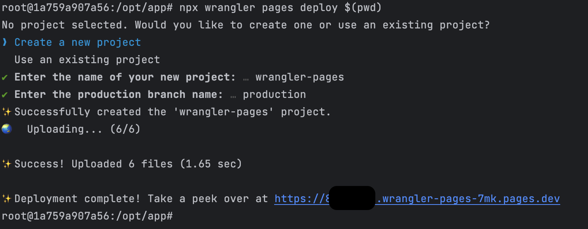

# Cloudflare Pages demo


### Objective
Deploy a ready-made HTML pages to Cloudflare Pages. And use docker to isolate local and deployment machine.

TODOs:
- custom http header like CORS, cache / cache invalidation
- URL rewrite for beauty url or RESTful
- Environment settings, not only production

reference:
https://developers.cloudflare.com/workers/configuration/sites/start-from-scratch/

### Requirements
- Docker only


### Deploy
```shell
# run docker container for deployment
### expose port 8976 for wrangler login
### expose port 8787 for wrangler dev
### expose port 8788 for wrangler page dev $(pwd)
docker run --rm -it -p 8081:8787 -p 8082:8788 -p 8090:8976 -v $(pwd):/opt/app -w /opt/app node:20.3.1-bookworm-slim bash

# install wrangler
npm install wrangler
# will generate Cloudflare link and callback localhost:8976 port
npx wrangler login

# run locally
npx wrangler pages dev $(pwd)/public

# deploy - it will ask the cloudflare project (chose exist or create new one) and production branch name
npx wrangler pages deploy $(pwd)/public

# open browse to check the result
open https://xxxx.cloudflare-page.dev/xxxx


# useful commands
npx wrangler doc
npx wrangler pages project list
```

### Sample


